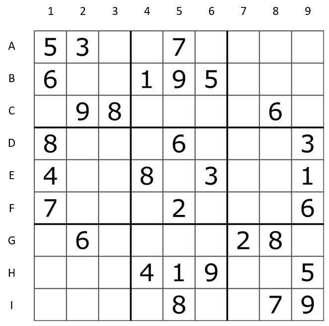

# AI-sudoku-puzzle
<b>A solver for sudoku puzzle boards given an arbitrary starting grid</b>

A standard sudoku puzzle board is a 9x9 grid, with <b>81 variables/tiles</b> in total. Each variable is named by its row and its column, and is assigned a value from 1 to 9, subject to the constraint that no two cells in the same row, column, or box may contain the same value. 

The initial configuration of the game is a partially filled sudoku board as shown below. The goal is to solve the puzzle such that all the constraints are satisfied. Algorithms for constraint satisfaction problems work efficiently for the sudoku puzzle.

  

## Python game representation

The <b>sudoku board</b> is <b>represented as a python dictionary</b>. The keys of the dictionary will be the variable names, each of which corresponds directly to a location on the board. In other words, we use the variable names Al through A9 for the top row (left to right), down to I1 through I9 for the bottom row. For example, in the example board above, we would have sudoku["B1"] = 6, and sudoku["E9"] = 1. 

All constraints are stored and evaluated in the <b>CSP class</b>.

## Algorithms

Two algorithms are implemented to develop this solver:

1. <b>AC-3 algorithm</b>. Constraint satisfaction algorithm that uses the simplest form of propagation to make the solution <b>arc-consistent</b>, i.e., if and only if every value x in X is consistent with some y of Y. It will check the remaining legal values, making sure all tiles still have a possible assignment at each iteration.
2. <b>Backtrack search algorithm</b>. Basic uninformed <b>depth-first search</b> algorithm, assigning one variable at a time checking constraints on the go using the <b>minimum remaining value heuristic</b>. <b>Forward checking</b> is applied to reduce variables domains.

AC3 does not perform as well as originally expected for these type of problems with just 3 puzzles solved out of 400 initial configurations tested. However, all the puzzles are solved using BTS. 

## Running the code

Each sudoku puzzle is represented as a single line of text, which starts from the top-left corner of the board, and enumerates the digits in each tile, row by row. For example:

<code> initial_configuration_string = "003020600900305001001806400008102900700000008006708200002609500800203009005010300"</code>

Use the following command to solve the specified puzzle:

<code>$ python3 driver.py initial_configuration_string</code>

The solution for the sudoku will be written in a plain text file, <i>output.txt</i>, specifying the algorithm that was used to solve the problem.

For more example check the <i>sudokus_start.txt</i> and <i>sudokus_finish.txt</i> files.
